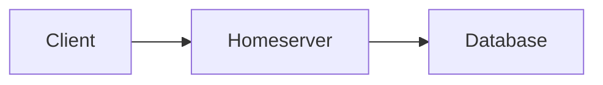
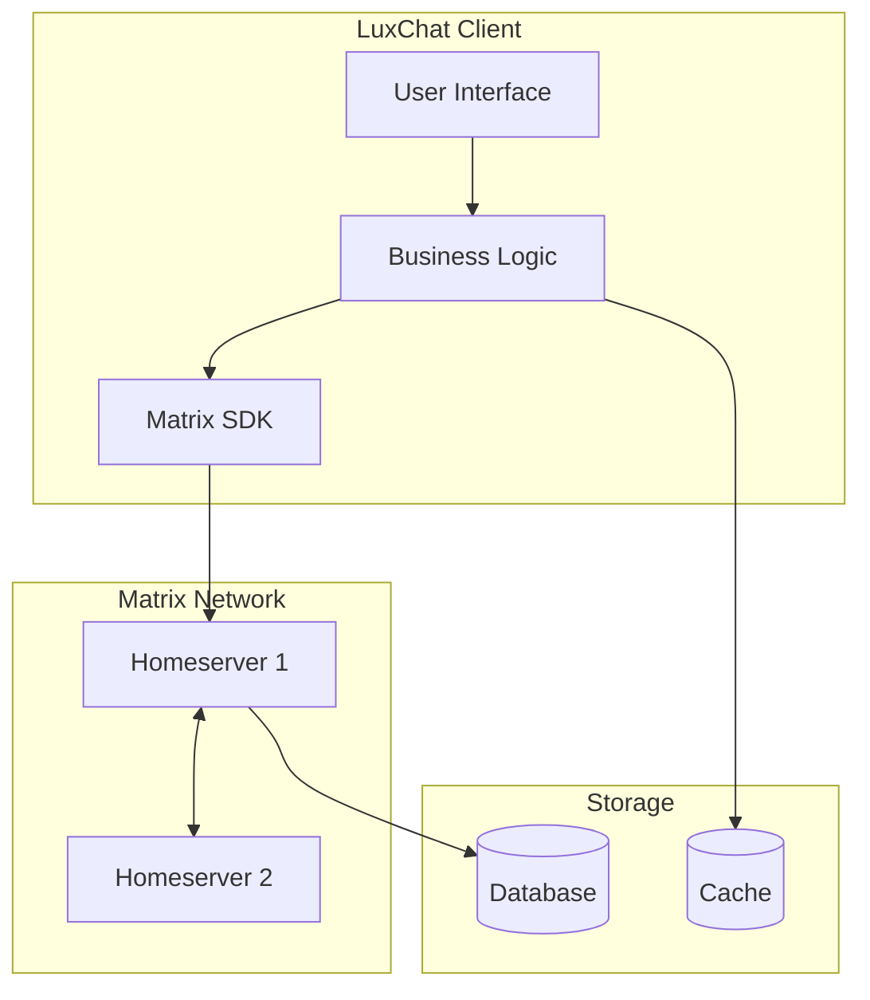
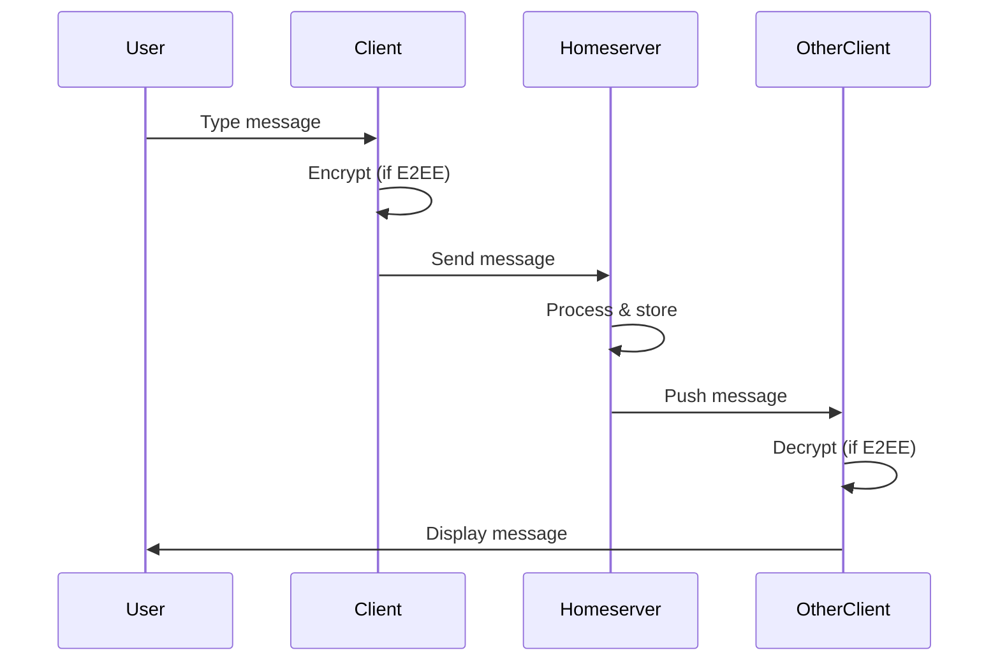
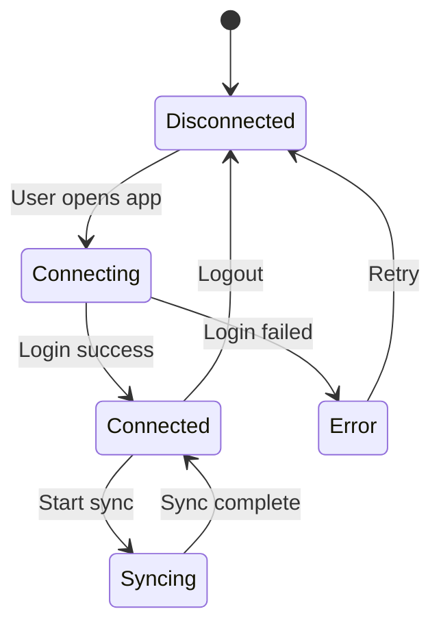
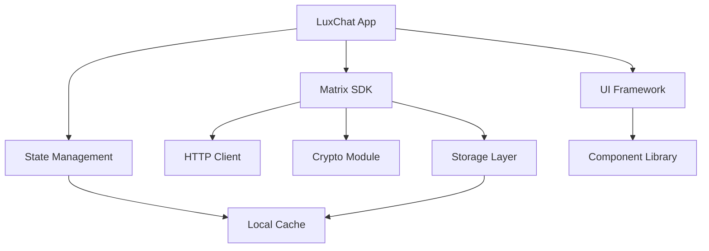

# Example Diagrams

This directory contains diagrams and visual resources for the LuxChat hackathon documentation.

## Diagram Formats Supported

### 1. Mermaid (Recommended)
Mermaid diagrams can be embedded directly in markdown files and will render on GitHub.

Example:


### 2. Image Files
Standard image formats (PNG, JPG, SVG) can be placed in this directory and referenced in markdown.

Example usage in markdown:
```markdown

```

## Creating Diagrams

### Using Mermaid
1. Visit [Mermaid Live Editor](https://mermaid.live/)
2. Create your diagram
3. Copy the mermaid code into your markdown file

### Using Draw.io
1. Visit [draw.io](https://draw.io/)
2. Create your diagram
3. Export as PNG or SVG
4. Save to this directory
5. Reference in your markdown

### Using Excalidraw
1. Visit [Excalidraw](https://excalidraw.com/)
2. Create your diagram
3. Export as PNG or SVG
4. Save to this directory

## Example Diagrams

### System Architecture (Mermaid)



### Message Flow (Mermaid)



### State Diagram (Mermaid)



### Component Relationships (Mermaid)



## Diagram Best Practices

1. **Keep it simple**: Don't overcrowd diagrams with too much information
2. **Use consistent styling**: Stick to a color scheme and style
3. **Add legends**: If using custom symbols or colors, include a legend
4. **Label clearly**: All components should have clear, descriptive labels
5. **Update regularly**: Keep diagrams in sync with implementation
6. **Version control**: Consider adding version numbers or dates to complex diagrams

## File Naming Convention

Use descriptive, lowercase names with hyphens:
- `system-architecture.png`
- `message-flow-diagram.svg`
- `e2ee-flow.png`
- `room-state-resolution.svg`

## Contributing Diagrams

When adding a new diagram:
1. Create the diagram using one of the recommended tools
2. Save it in this directory with a descriptive name
3. Add a reference in the relevant markdown document
4. Optionally, add an entry to this README describing the diagram

## Resources

- [Mermaid Documentation](https://mermaid.js.org/)
- [Mermaid Live Editor](https://mermaid.live/)
- [Draw.io](https://draw.io/)
- [Excalidraw](https://excalidraw.com/)
- [PlantUML](https://plantuml.com/)
