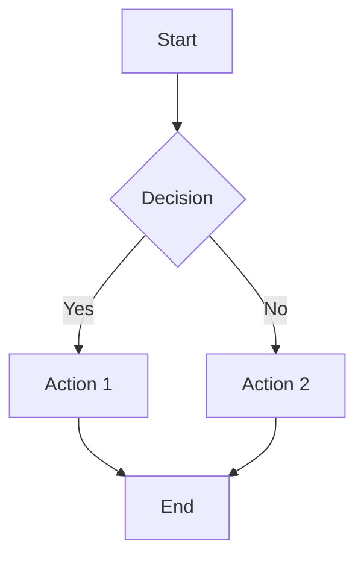
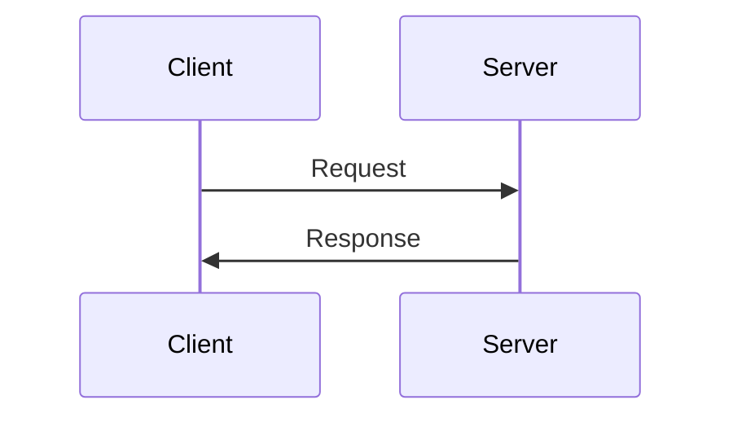
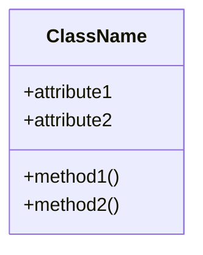

# Resource Template

Use this template to add new documentation pages to the LuxChat hackathon repository.

---

# [Document Title]

## Overview

Brief introduction to the topic (1-2 paragraphs).

## Table of Contents

- [Section 1](#section-1)
- [Section 2](#section-2)
- [Section 3](#section-3)
- [Resources](#resources)

## Section 1

### Subsection 1.1

Content for subsection 1.1.

#### Code Example

```language
// Code example
function example() {
  return "Hello, World!";
}
```

#### Bullet Points

- Point 1
- Point 2
- Point 3

### Subsection 1.2

Content for subsection 1.2.

#### Numbered List

1. Step 1
2. Step 2
3. Step 3

## Section 2

### Tables

| Column 1 | Column 2 | Column 3 |
|----------|----------|----------|
| Data 1   | Data 2   | Data 3   |
| Data 4   | Data 5   | Data 6   |

### Links

- [External Link](https://example.com)
- [Internal Link](./other-document.md)

## Section 3

### Images & Diagrams


### Blockquotes

> This is a quote or important note
> that spans multiple lines.

### Task Lists

- [ ] Task 1
- [ ] Task 2
- [x] Completed task

## Diagram Examples

### Mermaid Diagrams

#### Flowchart



#### Sequence Diagram



#### Class Diagram



## Code Blocks

### JavaScript

```javascript
const example = () => {
  console.log('Hello, World!');
};
```

### Python

```python
def example():
    print("Hello, World!")
```

### TypeScript

```typescript
interface Example {
  name: string;
  value: number;
}

const example: Example = {
  name: "test",
  value: 42
};
```

### JSON

```json
{
  "key": "value",
  "array": [1, 2, 3],
  "nested": {
    "property": "value"
  }
}
```

### Bash/Shell

```bash
# Install dependencies
npm install

# Run the application
npm start
```

## Advanced Formatting

### Collapsible Sections (GitHub)

<details>
<summary>Click to expand</summary>

Hidden content goes here.

</details>

### Inline Code

Use `inline code` for commands, variables, or short code snippets.

### Emphasis

- **Bold text**
- *Italic text*
- ***Bold and italic***
- ~~Strikethrough~~

### Horizontal Rule

---

### Emoji (GitHub)

:rocket: :book: :computer: :bulb: :tada:

## Resources

### Related Documentation
- [Document 1](./related-doc-1.md)
- [Document 2](./related-doc-2.md)

### External Links
- [External Resource 1](https://example.com)
- [External Resource 2](https://example.com)

### Tools
- Tool 1
- Tool 2

## Next Steps

- [ ] Read [Next Document](./next-document.md)
- [ ] Try [Example Project](./examples/)
- [ ] Explore [Related Topic](./related-topic.md)

## Contributing

To add content to this document:

1. Edit the file
2. Add your content following the existing format
3. Commit your changes
4. Update the main INDEX.md if needed

## Notes

Additional notes or important information.

---

**Last Updated**: [Date]  
**Author**: [Your Name]  
**Reviewers**: [Reviewers if applicable]
